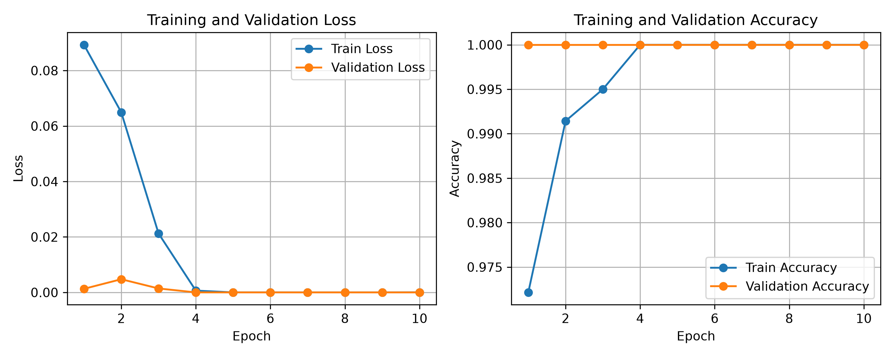
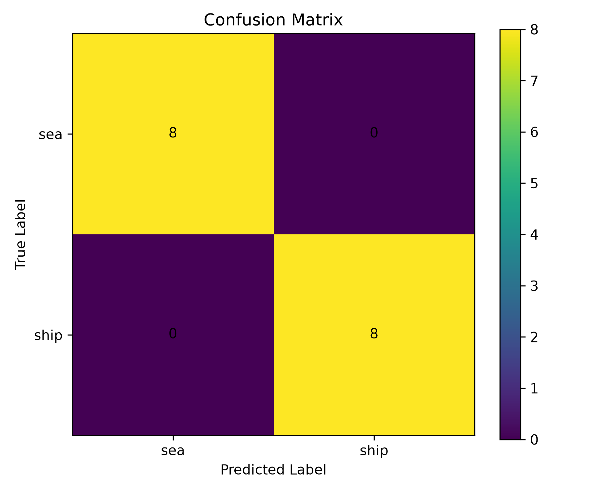

# Global SAR Ship-Sea Classification

This repository contains a prototype deep learning pipeline for **Synthetic Aperture Radar (SAR) ship-sea classification**.

The main goal of the project is to classify grayscale SAR image patches into two classes:

* `ship`
* `sea`

The project includes dataset preparation, train/validation/test splitting, a PyTorch dataset loader, a simple CNN model, GPU-supported training, and test evaluation.

---

## Project Overview

Synthetic Aperture Radar images are widely used in remote sensing because SAR sensors can operate independently of daylight and are less affected by cloud coverage compared to optical sensors.

In this project, SAR image patches are used for a binary classification task:

| Class  | Description                             |
| ------ | --------------------------------------- |
| `ship` | SAR patches containing ship targets     |
| `sea`  | SAR patches containing open sea surface |

The current implementation uses a lightweight convolutional neural network as a prototype model for ship-sea classification.

---

## Dataset

The dataset used in the current prototype is balanced:

| Class | Number of Images |
| ----- | ---------------: |
| Ship  |             1000 |
| Sea   |             1000 |
| Total |             2000 |

The dataset is split as:

| Split      | Ship | Sea | Total |
| ---------- | ---: | --: | ----: |
| Train      |  700 | 700 |  1400 |
| Validation |  150 | 150 |   300 |
| Test       |  150 | 150 |   300 |

### Data Sources

* Ship images were selected from OpenSARShip SAR ship patches with multiple vessel categories.
* Sea images were generated from European Sentinel-1 open-sea SAR regions using Google Earth Engine.

> Note: Since the ship and sea samples may come from different data sources, the current results should be interpreted as prototype-level results.

---

## Project Structure

```text
Radar-Signal-Processing/
│
├── app/
│   └── Streamlit or demo application files
│
├── config/
│   └── dataset_config.yaml
│
├── data/
│   ├── raw/
│   │   ├── ship/
│   │   └── sea/
│   │
│   └── processed/
│       ├── train/
│       ├── val/
│       ├── test/
│       └── metadata.csv
│
├── models/
│   └── trained model files
│
├── notebooks/
│   └── experiment notebooks
│
├── scripts/
│   ├── check_dataset.py
│   ├── split_dataset.py
│   └── prepare_dataset.py
│
├── src/
│   ├── dataset.py
│   ├── model.py
│   ├── train.py
│   └── evaluate.py
│
├── requirements.txt
└── README.md
```

---

## Installation

Create and activate a virtual environment:

```powershell
python -m venv .venv
.\.venv\Scripts\Activate.ps1
```

Install the required packages:

```powershell
python -m pip install --upgrade pip
python -m pip install -r requirements.txt
```

For GPU-supported PyTorch installation, use the official PyTorch installation command according to your CUDA version.

Example:

```powershell
python -m pip install torch torchvision --index-url https://download.pytorch.org/whl/cu128
```

---

## Dataset Preparation

Raw images should be placed under:

```text
data/raw/ship/
data/raw/sea/
```

Check the number of raw images:

```powershell
python scripts/check_dataset.py
```

Prepare the dataset:

```powershell
python scripts/prepare_dataset.py
```

This script:

* reads raw SAR images,
* converts them to grayscale,
* resizes them to 256×256,
* splits them into train/validation/test folders,
* saves processed images as PNG files,
* creates a metadata CSV file.

---

## Training

Train the CNN model:

```powershell
python src/train.py
```

The training script uses:

* PyTorch
* CrossEntropyLoss
* Adam optimizer
* CUDA GPU if available

The trained model is saved to:

```text
models/simple_sar_classifier.pth
```

---

## Evaluation

Evaluate the trained model on the test set:

```powershell
python src/evaluate.py
```

Example test result from the current prototype:

```text
SAR Ship-Sea Test Evaluation
============================
Using device: cuda
Test samples: 300
Test accuracy: 1.0000

Per-class results:
  sea: 150/150 correct | accuracy: 1.0000
  ship: 150/150 correct | accuracy: 1.0000
```

---

## Model Architecture

The current model is a simple CNN classifier:

```text
Input: 1 × 256 × 256 grayscale SAR image

Conv2D: 1 → 16
ReLU
MaxPool2D

Conv2D: 16 → 32
ReLU
MaxPool2D

Conv2D: 32 → 64
ReLU
MaxPool2D

Flatten
Linear: 65536 → 128
ReLU
Dropout
Linear: 128 → 2
```

The output classes are:

```text
0 -> sea
1 -> ship
```

---

## Current Results

The expanded prototype achieved:

| Metric              | Result |
| ------------------- | -----: |
| Training Accuracy   |   100% |
| Validation Accuracy | 100% |
| Test Accuracy       |   100% |

These results show that the pipeline works successfully on the current 2000-image balanced prototype dataset.

---

### Result Figures

#### Training Curves

The training and validation loss/accuracy curves are shown below:



#### Confusion Matrix

The confusion matrix on the test set is shown below:




### Latest Expanded Dataset Run

The dataset was expanded from the initial 100-image prototype to a balanced 2000-image dataset.

| Class | Number of Images |
|---|---:|
| Ship | 1000 |
| Sea | 1000 |
| Total | 2000 |

The processed dataset split is:

| Split | Ship | Sea | Total |
|---|---:|---:|---:|
| Train | 700 | 700 | 1400 |
| Validation | 150 | 150 | 300 |
| Test | 150 | 150 | 300 |

The CNN model was retrained using the expanded dataset and achieved 100% accuracy on the 300-image test set.

> Note: Since ship images are selected from OpenSARShip and sea patches are generated from Sentinel-1 open-sea regions, the results should still be interpreted carefully with respect to possible source-domain differences.

## Limitations

The current version is an early prototype. The main limitations are:

* The dataset is larger than the initial prototype, but it is still limited for real-world generalization.
* The test set contains 300 images, but the samples are still derived from limited data sources.
* Ship and sea images come from different data sources, so source-related bias may still exist.
* The model may learn source-related differences in addition to ship-sea features.
* More diverse SAR images from different regions, seasons, incidence angles, and sea states are needed.

Therefore, the current accuracy should not be interpreted as final real-world performance.

---

## Future Work

Planned improvements include:

* increasing the dataset size,
* adding more diverse Sentinel-1 SAR patches,
* using external SAR ship datasets,
* testing stronger CNN architectures,
* adding data augmentation,
* evaluating with confusion matrix and precision/recall/F1-score,
* developing a Streamlit demo interface,
* comparing SAR preprocessing methods.

---

## Project Status

Current completed stages:

* Dataset collection
* Dataset preparation
* Train/validation/test split
* PyTorch dataset loader
* CNN model implementation
* GPU-supported training
* Test evaluation
* GitHub integration

This repository currently represents a working prototype for SAR-based ship-sea classification using a 2000-image balanced dataset.
