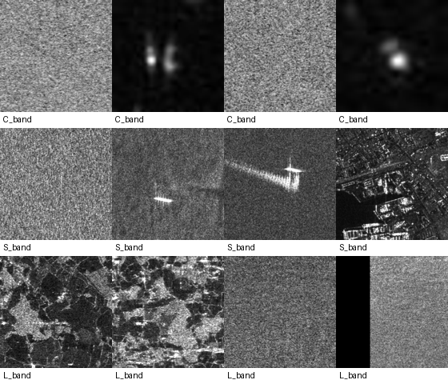
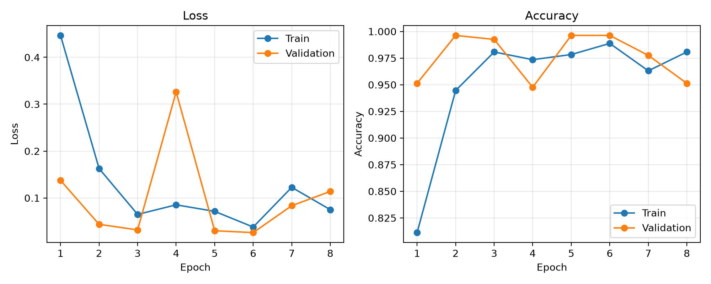
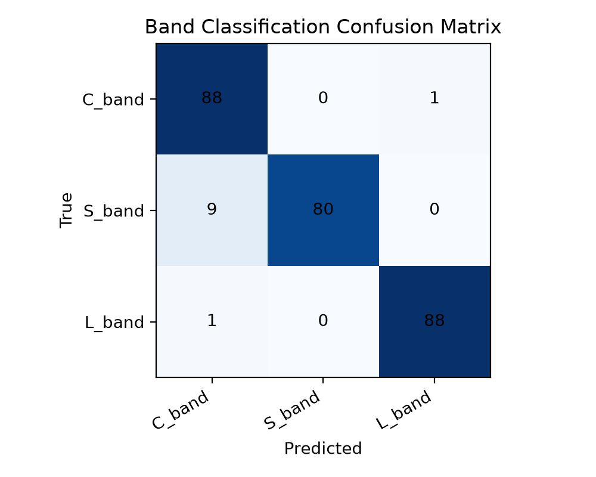

# Multi-frequency SAR band demo

This quick demo prepares a small three-class dataset and trains a lightweight
CNN to classify SAR patches by radar frequency band:

- `C_band`: Sentinel-1 C-band ship/sea patches from this repository, if present
- `S_band`: NovaSAR S-band patches from
  `C:\SAR_Datasets\novasar_sband\multiclass_clean_6class\balanced_158`
- `L_band`: ALOS PALSAR L-band pilot images and/or selected candidate folders

The dataset copy is written outside GitHub:

```text
C:\SAR_Datasets\multifrequency_band_demo
```

Generated training outputs go to:

```text
outputs/multifrequency_band_demo
```

Those outputs are ignored by Git because they are generated artifacts.

## Build the demo dataset

```powershell
python scripts/demo/build_multifrequency_band_dataset.py
```

The builder recursively finds images for each band, converts them to grayscale
`256x256` PNG, and balances the classes using the minimum available band count.
For example, if L-band has 14 images, the demo uses 14 C-band, 14 S-band, and
14 L-band images.

Optional L-band augmentation previews can be written with:

```powershell
python scripts/demo/build_multifrequency_band_dataset.py --augment-lband
```

## Train the CNN

Training is intentionally separate from dataset building:

```powershell
python src/train_multifrequency_band_demo.py
```

Expected outputs:

- `confusion_matrix.png`
- `training_curves.png`
- `metrics.json`
- `sample_grid.png`
- `multifrequency_band_demo_cnn.pth`

## Safety notes

The scripts copy normalized demo PNGs only. They do not move or delete raw SAR
scenes, candidate patches, final datasets, or zip files. Raw scenes and generated
datasets should remain outside the repository and should not be committed.

---

## Meeting Demo Results

This experiment is a quick multi-frequency SAR validation demo.

The goal is not final ship/sea classification. Instead, the model checks whether SAR patches from different frequency bands can be collected into one pipeline and separated by a lightweight CNN.

### Dataset Summary

| Class | SAR Band | Source Type |
|---|---|---|
| C_band | C-band | Sentinel-1 ship/sea data |
| S_band | S-band | NovaSAR / NASTaR ship data |
| L_band | L-band | ALOS PALSAR data |

Balanced dataset:

- 593 images per band
- 3 classes
- 1779 total images

### Sample Grid



### Training Curves



### Confusion Matrix



### Test Result

The confusion matrix shows:

- Correct predictions: 256 / 267
- Approximate test accuracy: 95.88%

### Important Note

This is not the final ship/sea model. It is a fast validation experiment showing that C-band, S-band, and L-band SAR image patches can be handled in a single multi-frequency pipeline.

The next step is to increase the number of clean L-band ship samples and move toward a band-aware ship/sea classification model.

